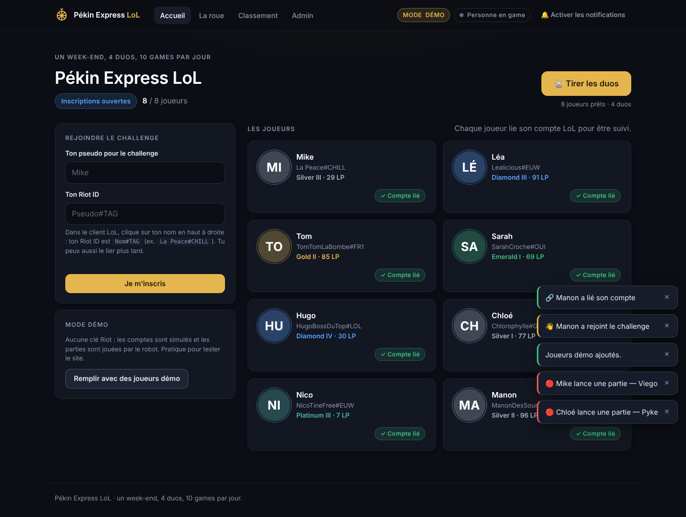
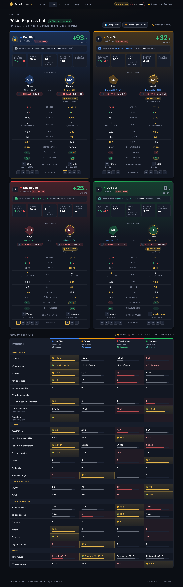
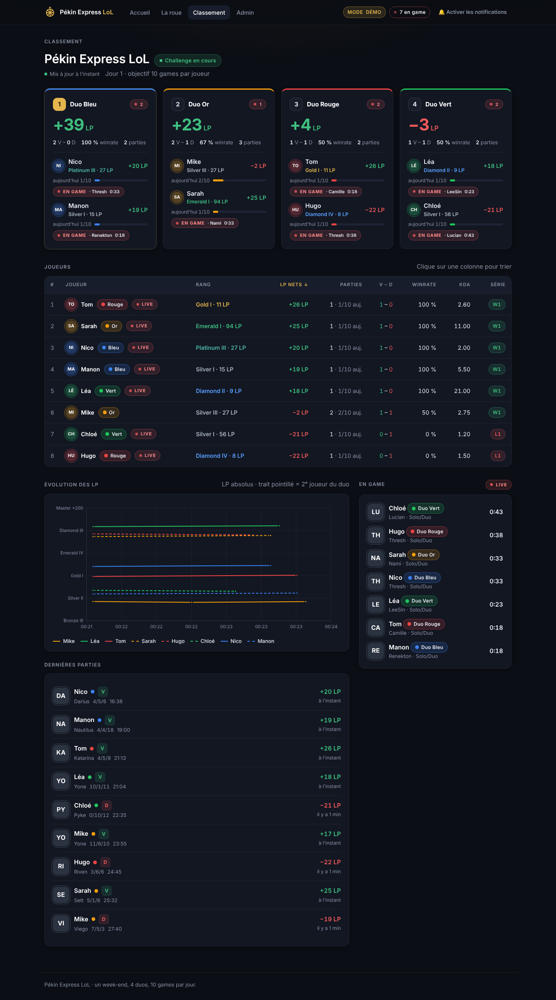
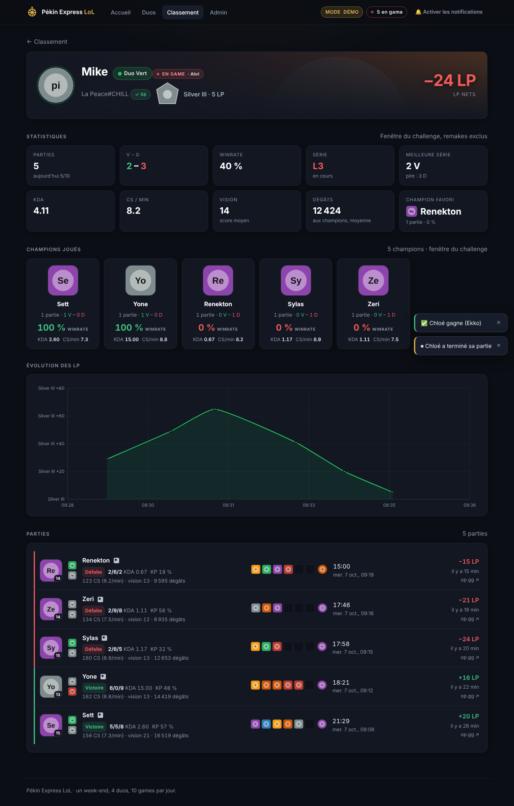

# Pékin Express LoL

Un petit site pour organiser un **challenge ranked League of Legends entre 8 amis**, sur un
week-end : l'organisateur compose 4 duos, chacun joue ses parties classées, et le site suit
tout en temps réel grâce à l'API Riot. Le duo qui gagne le plus de LP l'emporte.

| Accueil (inscriptions) | Les duos |
|---|---|
|  |  |

| Classement en direct | Fiche joueur |
|---|---|
|  |  |

*(captures prises en mode démo : comptes, parties et images simulés — chez toi, les vraies icônes, splashs et emblèmes de Riot s'affichent)*

---

## Le jeu en deux minutes

- **8 joueurs**, inscrits sur la page d'accueil avec leur Riot ID (`Pseudo#TAG`).
- L'organisateur compose les **4 duos** dans la page Admin (ou les tire au sort en un clic).
- Objectif : **10 games classées par jour et par joueur** (réglable) ; au-delà, les parties ne comptent pas.
- **Le duo gagnant est celui qui a gagné le plus de LP nets**, c'est-à-dire la somme des LP
  gagnés (ou perdus) par ses deux joueurs depuis le début du challenge.
- Tout est suivi automatiquement : rang, parties, KDA, séries, qui est « en game »…

### Comment sont calculés les LP nets ?

Le site prend régulièrement une « photo » du rang de chaque joueur (tier, division, LP).
Chaque rang est converti en une valeur absolue : Iron IV 0 LP = 0, chaque division vaut
100 LP, Master et au-delà = 2800 + LP. Les LP nets d'un joueur sont simplement :

```
LP nets = valeur absolue du rang actuel − valeur absolue du rang au début du challenge
```

Passer de Gold IV 80 LP à Gold III 10 LP fait donc **+30 LP nets**, promotion comprise.
Un joueur non classé (« Unranked ») compte pour 0. Les LP nets d'un duo = somme de ses deux
joueurs. En cas d'égalité, le winrate puis le nombre de parties départagent.

### Programmer le début et la fin

Dans **Admin → Challenge**, renseigne **Début** et **Fin** (heure de Paris), puis clique sur
**🚀 Démarrer** quand tous les joueurs sont inscrits et en duo, même la veille : seules les
parties **terminées** entre le début et la fin comptent. Les pages affichent « ⏳ Démarre … »
jusqu'à l'heure de début. À l'heure de fin, les stats sont figées, et 15 minutes plus tard le
challenge passe tout seul à « Terminé » (inutile de cliquer « Terminer » ; si tu le fais après
la fin, la fin programmée est gardée). Laisse le site tourner **avant le début** (les LP de
référence sont relevés à cette heure-là) et **jusqu'à 15 min après la fin**.

### Le joker 🃏

Chaque duo a **un joker** pour tout le challenge (réglable dans Admin → Challenge). Un joueur
du duo l'active sur la page **Duos** (bouton « 🃏 Activer le joker »), pendant le challenge :
ce jour-là, les deux joueurs ont droit à **13 parties comptées au lieu de 10** (3 de plus,
réglable). Seules les parties **terminées après l'activation** profitent des 3 parties en
plus : pas de joker « après coup » sur des parties déjà jouées. L'activation est annoncée à
tout le monde (pages et Discord). L'organisateur peut l'annuler dans **Admin → Duos** (le duo
le récupère).

### Ce qui compte, ce qui ne compte pas

- Seules les parties **Ranked Solo/Duo** comptent (la **Flex** peut être ajoutée en option).
- Les **remakes** (parties de moins de 5 minutes) sont **exclus** des statistiques.
- Les LP d'une partie terminée **avant le début ou après la fin** ne comptent pas, même si Riot
  ne les publie qu'après coup : les compteurs de victoires et défaites de Riot disent combien
  de parties chaque relevé de rang couvre, et la part des parties hors des heures est retirée.
- Une partie compte si elle **se termine** entre « Démarrer » et « Terminer » (c'est à la fin
  de la partie que les LP sont attribués). Une partie en cours au moment du clic sur
  « Démarrer » compte donc, et le compteur « 10 games par jour » suit la même règle.
- **Au-delà de 10 parties dans la journée, une partie ne compte pas** : ni ses LP, ni ses
  victoires/défaites, ni ses stats. La journée est celle de la fin de partie (heure de Paris).
  Les LP d'une partie hors quota sont retirés des LP nets à partir des relevés de rang pris
  avant et après elle. Elle reste visible avec la mention « ⛔ Hors quota » (fiche joueur, fil
  des parties, Discord), et la fiche joueur indique combien de LP n'ont pas été comptés.

---

## Démarrage rapide en mode démo (sans clé Riot)

Le mode démo simule 8 joueurs et leurs parties : idéal pour découvrir le site ou le tester
avant le week-end. Aucune connexion à Riot n'est nécessaire.

Prérequis : **Python 3.11 ou plus récent**.

```bash
# 1. Récupérer le projet et se placer dedans
cd PekinExpressLoL

# 2. Créer un environnement virtuel et installer les dépendances
python -m venv .venv
source .venv/bin/activate        # Windows : .venv\Scripts\activate
pip install -r requirements.txt

# 3. Lancer le serveur
uvicorn app.main:app --reload
```

Puis ouvre **http://localhost:8000**. Sans fichier `.env` (ou avec `RIOT_API_KEY` vide), le
site démarre automatiquement en **MODE DÉMO** (badge dans la barre de navigation).

Sur la page d'accueil, clique sur **« Remplir avec des joueurs démo »** : 8 joueurs fictifs
sont inscrits et liés. Tu peux ensuite composer les duos dans **Admin → Duos**, démarrer le
challenge et regarder le classement bouger tout seul (les parties simulées durent entre 45
et 90 secondes).

Le mot de passe organisateur par défaut est `change-me`.

---

## Passer en réel : brancher l'API Riot

### 1. Obtenir une clé

Va sur [developer.riotgames.com](https://developer.riotgames.com) et connecte-toi avec ton
compte Riot.

- **Clé de développement** : disponible immédiatement sur la page d'accueil du portail,
  mais elle **expire toutes les 24 h**. Il faut la régénérer et la recoller dans `.env`
  chaque jour (voir « Recharger .env » plus bas). Suffisant pour un week-end si quelqu'un
  s'en occupe.
- **Clé personnelle (Personal API Key)** : il faut enregistrer une « application » sur le
  portail (quelques lignes de description, validation par Riot sous quelques jours). Elle
  **n'expire pas** : c'est la solution confortable.

Les deux types de clé ont les mêmes limites de débit (voir plus bas).

### 2. Remplir le fichier `.env`

Copie `.env.example` en `.env` à la racine du projet et complète-le. Chaque variable :

| Variable | Rôle |
|---|---|
| `RIOT_API_KEY` | Ta clé Riot. Vide = mode démo. |
| `RIOT_PLATFORM` | Serveur de jeu des joueurs : `euw1` (défaut), `eun1`, `na1`, `kr`… |
| `RIOT_REGION` | Région de routage correspondante : `europe` (défaut), `americas`, `asia`, `sea`. |
| `DEMO_MODE` | `true` pour forcer la simulation même avec une clé, `false` pour forcer le réel. Vide = automatique (démo si pas de clé). |
| `POLL_INTERVAL_SECONDS` | Secondes entre deux interrogations de l'API Riot (défaut : 90 en réel, 10 en démo ; minimum 3). |
| `LIVE_POLL_SECONDS` | Secondes entre deux vérifications « qui est en game ? » entre deux interrogations complètes (défaut : 30, minimum 10). C'est ce qui déclenche les notifications de partie. |
| `TRACK_FLEX` | `true` pour suivre aussi la file Flex (défaut `false`). Modifiable ensuite dans l'admin. |
| `ADMIN_PASSWORD` | Mot de passe de l'organisateur (page admin, duos, démarrage). **À changer** (défaut `change-me`). |
| `DATABASE_URL` | Base SQLite. Défaut : `sqlite:///./data/tracker.db` (fichier dans `data/`). |
| `GAMES_PER_DAY` | Objectif de parties par jour et par joueur (défaut 10). Modifiable ensuite dans l'admin. |
| `CHALLENGE_START` / `CHALLENGE_END` | Dates par défaut du challenge, format `jj/mm/aaaa hh:mm`, heure de Paris (défaut : `10/10/2026 09:00` et `12/10/2026 00:00`, minuit dans la nuit du dimanche au lundi). Appliquées tant qu'aucune date n'est enregistrée ; modifiables ensuite dans l'Admin. |
| `AUTO_TUNNEL` | Windows : `PekinExpress.bat` ouvre aussi le tunnel Cloudflare (défaut `true`). |
| `TUNNEL` | Type de tunnel : `rapide` (défaut, adresse qui change), `tailscale` (lien fixe gratuit) ou `cloudflare` (lien fixe sur ton domaine). Voir « Lien fixe ». |
| `CLOUDFLARE_TUNNEL_TOKEN` | Mode `cloudflare` : jeton du tunnel nommé (secret, reste dans `.env`). |
| `GITHUB_TOKEN` | Lien fixe GitHub Pages : jeton GitHub (Contents en écriture sur ce dépôt). Le site y publie son adresse du moment. Vide = désactivé. |
| `MAX_PLAYERS` | Nombre maximal de joueurs inscrits (défaut 8). Au-delà, l'inscription est refusée. |
| `TIMEZONE` | Fuseau pour découper les journées (défaut `Europe/Paris`). |
| `DISCORD_WEBHOOK_URL` | URL d'un webhook Discord pour recevoir les annonces. Vide = désactivé. |
| `DISCORD_ROLE_ID` | Identifiant du rôle à mentionner dans chaque message (ex. @PekinExpress). Vide = pas de mention. |
| `KLIPY_API_KEY` | Clé gratuite Klipy pour les GIF des résultats. Vide = pas de GIF (sauf liens de secours). |
| `DISCORD_GIF_SEARCH_LOSS` / `DISCORD_GIF_SEARCH_WIN` | Catégories Klipy (séparées par des virgules) ; une est tirée au hasard à chaque défaite / victoire. Vide = catégories par défaut, `off` = aucun GIF. |
| `DISCORD_GIF_LOSS` / `DISCORD_GIF_WIN` | Liens de GIF de secours si Klipy ne répond pas (séparés par des espaces). |
| `BASE_URL` | Adresse publique du site pour les messages Discord. Inutile avec le tunnel Cloudflare (adresse détectée automatiquement) ; à renseigner seulement si tu as ta propre adresse. |

### 3. Appliquer la configuration

Deux possibilités :

- **Relancer** le serveur (`Ctrl+C` puis `uvicorn app.main:app --reload`), ou
- aller sur la page **Admin** et cliquer sur **« Recharger .env »** : la nouvelle clé est
  prise en compte sans redémarrer. C'est aussi comme ça qu'on remplace une clé de
  développement expirée.

Le badge « MODE DÉMO » disparaît quand une clé est active. Si la clé est refusée, les
erreurs apparaissent dans la section « Système » de l'admin (« Clé Riot invalide ou
expirée »).

### Bon à savoir sur l'API Riot

- **Limites de débit** : 20 requêtes par seconde et 100 requêtes par 2 minutes. Le site les
  respecte tout seul (file d'attente, pauses si Riot renvoie un 429). Avec 8 joueurs et un
  cycle toutes les 90 s, on est très loin du plafond.
- **Délai d'apparition d'une partie** : Riot met en général **1 à 3 minutes** après la fin
  d'une partie pour la rendre disponible. Ajoute le délai de polling : une partie apparaît
  donc dans le feed quelques minutes après l'écran de victoire. C'est normal.
- **Le PUUID dépend de l'application Riot** : l'identifiant interne d'un compte est propre
  à la clé/application qui l'a demandé. Si tu changes de type de clé (par exemple d'une clé
  de développement vers une clé personnelle d'une autre application), les comptes déjà liés
  ne seront plus reconnus : il faut **relier les comptes** (bouton « Lier mon compte » sur
  l'accueil, ou réinitialiser le challenge). Ne fais pas ce changement en plein challenge.
- Le « en game » utilise l'API Spectator : un joueur apparaît en partie au cycle de polling
  suivant son lancement (donc jusqu'à 90 s après).

---

## Déroulé d'un challenge

Le challenge passe par 3 états : **inscriptions** (et composition des duos) → **en cours** → **terminé**.

### 1. Inscriptions (page d'accueil `/`)

Chaque joueur entre son pseudo pour le challenge et son **Riot ID** au format `Pseudo#TAG`
(visible dans le client LoL en cliquant sur son nom en haut à droite, ex. `La Peace#CHILL`).
Le site vérifie le compte auprès de Riot et affiche le rang actuel. On peut s'inscrire sans
Riot ID et le lier plus tard avec le bouton **« Lier mon compte »** sur sa carte.

Les duos apparaissent sur l'accueil et dans l'onglet **Duos** dès que l'organisateur les a
composés.

Une fois le challenge démarré, un compte déjà lié ne peut plus être changé par n'importe qui
(sinon l'historique de rang serait remplacé) : seul l'organisateur, avec son mot de passe,
peut corriger un Riot ID. Un joueur inscrit sans compte peut toujours lier le sien.

Astuce : l'organisateur peut pré-inscrire tout le monde dans `players.yaml` (lu une seule
fois, au premier démarrage, si aucun joueur n'existe encore).

### 2. Les duos (`/duos` et Admin → Duos)

Dans la page **Admin** (mot de passe organisateur, demandé une fois par session de
navigateur), section **Duos** : **« Ajouter un duo »**, puis choisir ses deux joueurs dans
les menus, lui donner un nom et une couleur, **Enregistrer**. Un joueur déplacé d'un duo à
l'autre est retiré du précédent. Pressé ? **« Former les duos au hasard »** fait les 4 duos
en un clic. Tant que le challenge n'a pas démarré, tout peut être modifié.

L'onglet **Duos** montre ensuite, pour chaque duo, toutes ses statistiques : LP nets,
victoires / défaites, winrate, parties (et objectif du jour), KDA moyen, parties jouées
ensemble, et un **face-à-face des deux joueurs** stat par stat (LP nets, V–D, winrate, KDA,
CS/min, vision, dégâts, séries, champion favori) avec le **MVP du duo** (le plus de LP nets).

Puis, dans Admin, **« Démarrer le challenge »** : à partir de cet instant, les parties
comptent. Le site prend immédiatement la « photo » de rang de référence de chaque joueur.
Le démarrage est refusé tant qu'un joueur inscrit n'est pas dans un duo complet.

### 3. Le classement (`/dashboard`)

Pendant le challenge, la page classement affiche :

- le **podium des duos** avec leurs LP nets, victoires/défaites, winrate et le compteur
  « aujourd'hui x/10 » de chaque joueur ;
- le **tableau des joueurs**, triable par LP nets, parties, winrate ou KDA ;
- le **graphe d'évolution des LP** (une courbe par joueur, à la couleur de son duo) ;
- le **feed des dernières parties** (champion, KDA, durée, LP gagnés/perdus) ;
- le panneau **« En game »** : qui joue en ce moment, avec quel champion, depuis combien
  de temps.

**Partie en direct** : dès qu'un joueur est en partie (à partir de l'écran de chargement), le site
le met en **surbrillance** (lueur rouge sur sa carte de duo, sa ligne, son avatar et sa fiche) et
affiche le **tableau de la partie** : les 10 joueurs, alliés et ennemis, avec champion, sorts,
runes, Riot ID et bans ; les joueurs du challenge sont surlignés à la couleur de leur duo, avec
leur rang. Le tableau apparaît en haut du classement (« 🔴 En direct », un par partie : deux
joueurs du challenge dans la même partie, en duo ou face à face, partagent le même tableau), sous
l'en-tête de la fiche du joueur, et dans une fenêtre en cliquant n'importe quel badge
« En game ». Un **bandeau « En direct »** sous la barre de navigation montre les parties en cours
sur toutes les pages. Aucune requête Riot en plus : tout vient de la vérification « qui est en
game » que le site fait déjà. Riot ne donne ni le poste ni le score pendant la partie : le
tableau final (KDA, or, objets…) arrive dans « Dernières parties » quelques minutes après.

**Qui est connecté** : la pastille **« 🟢 N en ligne »** de la barre de navigation compte les
personnes qui ont le site ouvert (mise à jour toutes les 5 s, sans requête en plus). Un clic
montre la liste : les joueurs qui se sont identifiés (avec la page où ils sont, « en arrière-plan »
si l'onglet est caché, et un badge s'ils sont en game) et le nombre de visiteurs anonymes. Chacun
choisit **« Qui es-tu ? »** dans cette fenêtre (sinon il reste « spectateur ») ; ce choix est
retenu par le navigateur. C'est déclaratif (pas de connexion) : ça sert à l'affichage, jamais à
autoriser quoi que ce soit. Rien n'est enregistré sur disque, ni adresse IP : la liste est en
mémoire et une personne disparaît dès qu'elle ferme le site (ou au bout de 30 s à 75 s).

Chaque joueur a aussi sa fiche (`/player/<id>`) : rang, saison et pic, sa place parmi tous
les joueurs sur 22 statistiques, une cinquantaine de stats (combat, multikills, farm, or,
dégâts, vision, objectifs, temps, LP, séries), les répartitions par poste, côté, durée, heure
et jour, ses records, ses résultats avec et sans son partenaire, ses champions, son graphe et
la liste de ses parties (lien op.gg).

**Tableau des scores de chaque partie** (style op.gg) : bouton **📊 Détails** sous chaque partie
de l'historique d'un joueur (le tableau se déplie dans la fiche), et **📊 Tableau** dans les
dernières parties du classement. Les 10 joueurs, alliés et ennemis : champion, sorts, runes,
objets, KDA, participation aux kills, dégâts infligés et subis, or et **écart d'or avec
l'adversaire de la même voie**, CS, vision ; bilan et objectifs de chaque équipe, écart d'or
entre les équipes, badges MVP / ACE. Aucune requête Riot en plus : le détail de la partie est
déjà enregistré.

La page **Rangs** (`/rankings`) classe les joueurs par rang actuel : podium, places gagnées
ou perdues depuis le départ, pic de rang, saison, duos par rang moyen et répartition par
palier. La page **Duos** se termine par un **comparatif des duos** sur 26 statistiques
(meilleur duo en doré, pire en rouge).

La page se met à jour toute seule (flux d'événements), avec un rechargement de secours
toutes les 60 s.

### 4. Terminer

Dans la page **Admin**, **« Terminer »** lance un dernier relevé puis fige le classement à
l'instant du clic. Les parties terminées avant ce moment comptent (le site laisse quelques
minutes de marge pour que Riot les remonte) ; celles terminées après ne comptent plus.

### Option : une fenêtre différente par duo

Si les duos ne jouent pas le même week-end, l'organisateur peut définir dans l'admin, pour
chaque duo, une **fenêtre de début et de fin**. Les LP nets et les stats de ce duo sont
alors calculés sur sa propre fenêtre au lieu de celle du challenge. Laisser vide = fenêtre
du challenge.

---

## Notifications

Le principe : **prévenir tout le monde quand un duo lance une partie**, pour aller
l'encourager (ou le troller).

### Dans le navigateur

- Sur chaque page, des **toasts** (petits messages en bas de l'écran) annoncent les
  événements en direct : un joueur lance une partie, une partie est enregistrée, les duos
  sont composés, le challenge démarre…
- Le bouton **🔔 « Activer les notifications »** (barre de navigation) demande
  l'autorisation d'envoyer des **notifications système** même quand l'onglet n'est pas au
  premier plan. Elles sont envoyées pour : lancement d'une partie, partie enregistrée
  (résultat + LP), composition des duos, démarrage du challenge.
- Les navigateurs n'autorisent ces notifications que sur **`localhost` ou en HTTPS**. Sur une
  adresse `http://192.168.x.x` du LAN, le bouton n'aura pas d'effet (les toasts, eux,
  marchent toujours).
- Une fois activé, **re-cliquer sur « 🔔 Notifications actives » envoie une notification de
  test**. L'annonce d'une partie lancée reste affichée jusqu'au clic, joue deux bips et fait
  clignoter le titre de l'onglet.
- **Quand une partie est-elle vue ?** Riot ne la montre qu'à partir de l'**écran de
  chargement** (pas pendant la file ni la sélection des champions). Le site vérifie toutes les
  `LIVE_POLL_SECONDS` (30 s par défaut) : compte jusqu'à ~30 s après le début du chargement.
  **Admin → Système → « 🎮 Qui est en game ? »** vérifie tout de suite et déclenche la
  notification si une partie est trouvée.
- **Sous Windows**, « Ne pas déranger » (ex-assistant de concentration) s'active tout seul
  pendant une partie en plein écran et retient les notifications : elles attendent dans le
  centre de notifications. Pour être prévenu sur ton téléphone, le plus fiable est Discord
  (ci-dessous) : sur mobile, le navigateur ne notifie que tant que la page est ouverte.

### Sur Discord

Renseigne `DISCORD_WEBHOOK_URL` (dans Discord : réglages du salon → Intégrations → Webhooks
→ copier l'URL) et clique sur **« Tester Discord »** dans l'admin : il envoie un exemple de
carte de résultat, un GIF de victoire et un GIF de défaite. Le site poste ensuite :

- **Fin de partie** : une carte façon tracker — Riot ID et icône du joueur, portrait du
  champion, « Mike a gagné 19 LP (Solo/Duo) », rang actuel, puis KDA, durée, score (MVP/ACE ou
  place sur 10), CS/min, pings, dégâts (et par minute), vision/min, chance d'équipe (niveau des
  coéquipiers face aux adversaires), participation, écart d'or avec l'adversaire de voie, n° de
  la partie du jour, et les liens « Tableau des scores » (ouvre la partie sur le site), dpm.lol
  et op.gg. Liseré vert pour une victoire, rouge pour une défaite ; « hors quota » et « hors des
  heures du challenge » sont signalés. Si les deux joueurs d'un duo étaient dans la même
  partie, un seul message regroupe leurs deux cartes (« 🎉 Duo Rouge gagne en duo · +40 LP »).
- **GIF** : à chaque résultat, une catégorie est tirée au hasard (`DISCORD_GIF_SEARCH_WIN` ou
  `DISCORD_GIF_SEARCH_LOSS`) et un GIF au hasard est pris parmi les résultats Klipy. Il faut une
  clé Klipy gratuite (`KLIPY_API_KEY`, sur https://partner.klipy.com) ; sans elle, pas de GIF.
- **Début de partie** (parties classées) : 🔴 qui joue, quel champion, son rang ; un seul
  message si le duo lance la partie ensemble.
- **« C'est parti ! »** à l'heure du début du challenge (ex. samedi 9h) : rôle mentionné, objectif,
  duos, date de fin, lien du classement et le GIF `DISCORD_GIF_START` (une page Klipy suffit). Le site
  vérifie toutes les 30 s ; s'il était éteint à 9h, l'annonce part à son démarrage (jusqu'à 3 h de
  retard). Le challenge doit avoir été **démarré** (Admin → « 🚀 Démarrer », le début programmé est
  gardé).
- L'annonce du tirage des duos, du démarrage du challenge et des jokers.

**Mention du rôle** (ex. @PekinExpress) : active le mode développeur de Discord (Paramètres →
Avancés), puis Paramètres du serveur → Rôles → « ⋯ » ou clic droit sur le rôle → « Copier
l'identifiant du rôle », et mets ce numéro (17 à 20 chiffres) dans `DISCORD_ROLE_ID`. Dans les
réglages du rôle, active **« Permettre à tout le monde de @mentionner ce rôle »** : un rôle créé
dans Discord ne l'est pas par défaut, et un webhook ne peut alors faire sonner personne.

**« Tester Discord »** relit `.env`, envoie le message de test et affiche un diagnostic : Discord
renvoie le message créé, donc le site sait si la mention du rôle a vraiment été retenue. Si elle
l'est mais que rien ne sonne, c'est un réglage Discord de ton côté :

1. tu dois **avoir le rôle** toi-même (seuls ses membres sont notifiés) ;
2. Discord ne sonne pas pour le salon **déjà ouvert à l'écran** : teste depuis un autre salon ;
3. clic droit sur le serveur → Paramètres de notification : « Supprimer toutes les mentions de
   rôle » doit être décoché, et le serveur ou le salon ne doit pas être en sourdine ;
4. pas de statut « Ne pas déranger » ; sur téléphone, Discord ne notifie pas tant qu'il est actif
   sur le PC.

---

## La page Admin (`/admin`)

Protégée par le mot de passe `ADMIN_PASSWORD`. Une fois connecté :

| Section | Action | Effet |
|---|---|---|
| Challenge | **Enregistrer** | Modifie le nom, le nombre de games par jour, les dates de début/fin et l'option « Suivre aussi la file Flex ». |
| Challenge | **🚀 Démarrer** | Passe le challenge « en cours » (il faut que chaque joueur soit dans un duo complet). |
| Challenge | **🏁 Terminer** | Fige le classement. |
| Challenge | **Réinitialiser** | Supprime duos, photos de rang et parties ; retour aux inscriptions. Case à cocher pour garder ou non les joueurs inscrits. |
| Duos | **Ajouter un duo** / **Enregistrer** / **Supprimer** | Compose les duos (deux joueurs par duo), nom, couleur, fenêtre de dates optionnelle. **Former les duos au hasard** en un clic (avant le départ seulement). Pendant le challenge, les duos restent modifiables (joueur arrivé en retard : il s'inscrit sur l'accueil, puis tu le places dans un duo ; ses LP le suivent). Figés une fois le challenge terminé. |
| Joueurs | interrupteur **Actif** | Désactive un joueur (exclu du suivi, retiré de son duo) sans le supprimer. |
| Joueurs | **Supprimer** | Supprime le joueur, ses photos de rang et ses parties. Définitif. |
| Système | **Forcer un rafraîchissement** | Lance un cycle d'interrogation Riot immédiatement. |
| Système | **Recharger .env** | Relit `.env` (nouvelle clé, mode démo…) sans redémarrer. |
| Système | **Tester Discord** | Relit `.env` et envoie un message de test (exemple de carte, GIF de victoire et de défaite, mention du rôle), avec un diagnostic de la mention. |
| En-tête | **Se déconnecter** | Oublie le mot de passe dans ce navigateur. |

La section « Système » affiche aussi l'état du dernier cycle : date, durée, nombre de
requêtes Riot, erreurs éventuelles. C'est le premier endroit où regarder quand « ça ne
remonte pas ».

---

## Hébergement

> **Pourquoi pas GitHub Pages ?** GitHub Pages ne sert que des fichiers statiques (HTML, CSS,
> JS). Or ce site a besoin d'un **serveur** qui tourne en continu : c'est lui qui interroge
> Riot toutes les 90 s avec la clé (qui ne doit jamais être visible dans le navigateur),
> garde l'historique des rangs dans SQLite et pousse les notifications en direct. Le code
> est hébergé sur GitHub, mais le site doit tourner quelque part : sur le PC de l'un
> d'entre vous (gratuit) ou sur un petit serveur.

### Où mettre la clé Riot

La clé ne se partage jamais dans un chat, un message Discord ou un commit. Elle va :

- **sur ton PC** : dans le fichier `.env` à la racine du projet (créé automatiquement au
  premier lancement, ignoré par git) → `RIOT_API_KEY=RGAPI-xxxx` ;
- **sur un hébergeur** : dans ses « variables d'environnement » / « secrets »
  (`RIOT_API_KEY`, `ADMIN_PASSWORD`, `BASE_URL`…), jamais dans le dépôt.

Une clé de développement expire toutes les 24 h : quand elle change, remplace-la dans `.env`
puis clique sur **« Recharger .env »** dans la page Admin (pas besoin de redémarrer).

### Option 1 (recommandée) : sur le PC de l'organisateur

Le plus simple et gratuit. Le PC doit rester allumé pendant tout le challenge (c'est lui qui
interroge Riot).

- **Windows** : double-clique sur `PekinExpress.bat`. Au premier lancement il installe tout,
  crée `.env` et l'ouvre dans le Bloc-notes pour y coller la clé. Ensuite il démarre le site
  et ouvre http://localhost:8000.
- **macOS / Linux** : `./start.sh` (même comportement).

Les amis sur le **même réseau** ouvrent `http://<IP du PC>:8000` (par exemple
`http://192.168.1.42:8000` ; `ipconfig` sous Windows donne l'IP). Pense au pare-feu Windows
si personne n'arrive à se connecter.

Pour les amis **à distance**, `PekinExpress.bat` ouvre aussi, dans une seconde fenêtre, un
**tunnel Cloudflare** vers ton PC (gratuit, sans compte ; `Tunnel.bat`, qui télécharge
`cloudflared.exe` la première fois). L'adresse `https://xxxx.trycloudflare.com` à partager
s'affiche dans cette fenêtre **et dans Admin → Système** (détectée automatiquement, bouton
Copier) ; les messages Discord l'utilisent. Elle change à chaque lancement ; laisse les deux
fenêtres ouvertes. Pour ne pas ouvrir le tunnel : `AUTO_TUNNEL=false` dans `.env`. Le HTTPS
du tunnel permet aussi les notifications navigateur.

#### Lien fixe avec Cloudflare (gratuit) : page GitHub Pages

Le plus simple pour garder le tunnel Cloudflare rapide **et** un lien qui ne change jamais :
**https://kazza2115.github.io/PekinExpressLoL/**. Cette page renvoie aussitôt vers l'adresse
Cloudflare du moment ; ensuite tout passe directement par le tunnel, sans ralentissement. À
chaque lancement, le site publie lui-même sa nouvelle adresse sur GitHub (un petit commit du
fichier `docs/site.json`). `#/duos`, `#/dashboard`… à la fin du lien ouvrent directement la
page voulue.

À faire une seule fois :

1. **Activer GitHub Pages** : sur GitHub, dépôt PekinExpressLoL → **Settings → Pages** →
   *Build and deployment* : *Deploy from a branch*, branche `claude/quirky-pascal-y84evb`,
   dossier `/docs` → **Save**.
2. **Créer un jeton GitHub** : photo de profil → **Settings → Developer settings → Personal
   access tokens → Fine-grained tokens → Generate new token**. *Repository access* : *Only
   select repositories* → PekinExpressLoL. *Permissions → Repository permissions →
   Contents* : **Read and write**. Choisis une expiration après la fin du challenge.
3. Colle le jeton dans `.env` après `GITHUB_TOKEN=` (il ne quitte jamais ton PC, n'est jamais
   envoyé sur GitHub ni affiché par le site ; ne le colle nulle part ailleurs).
4. Relance `PekinExpress.bat` (avec `TUNNEL=rapide`, la valeur par défaut). Le navigateur
   s'ouvre tout seul **sur le lien fixe GitHub** dès que la nouvelle adresse y est publiée (en
   général moins d'une minute). **Admin → Système** affiche « Lien fixe à partager » et
   l'adresse vers laquelle il renvoie. Les messages Discord utilisent aussi ce lien fixe.
   Sans jeton, le navigateur s'ouvre sur l'adresse du tunnel ; avec `AUTO_TUNNEL=false`, en
   local.

Le site ne publie une adresse qu'une fois qu'elle répond vraiment (jamais celle d'un lancement
précédent). Si le PC est éteint, la page renvoie vers le dernier lien publié, qui ne répond
plus : relance simplement le site. Lance `PekinExpress.bat` **une seule fois** : il ferme
lui-même un ancien tunnel resté ouvert, et un second lancement se contente d'ouvrir le
navigateur (pas de second tunnel).

#### Autres liens fixes

Sans la page GitHub Pages ci-dessus, l'adresse `trycloudflare.com` change à chaque lancement.
Deux autres solutions donnent directement une adresse fixe (choisies par `TUNNEL=` dans `.env`) :

**A. Tailscale Funnel : gratuit, sans nom de domaine** → `https://nom-du-pc.xxxx.ts.net`

1. Installe Tailscale : https://tailscale.com/download/windows, puis connecte-toi (compte
   Google, Microsoft ou GitHub). Les amis n'ont **rien** à installer.
2. Dans `.env`, mets `TUNNEL=tailscale`, puis relance `PekinExpress.bat`.
3. La première fois, la fenêtre du tunnel affiche un lien pour **autoriser Funnel** : ouvre-le
   et accepte (Tailscale crée alors le certificat HTTPS).
4. L'adresse fixe s'affiche dans la fenêtre du tunnel et dans **Admin → Système** (« lien
   fixe »). Elle reste la même tant que le PC garde son nom dans Tailscale (renommable une
   fois pour toutes dans la console Tailscale, onglet Machines).
5. Si un message parle de droits d'administrateur : clic droit sur `Tunnel.bat` → « Exécuter
   en tant qu'administrateur ».

**B. Tunnel Cloudflare nommé : ton propre domaine** → `https://pekin.ton-domaine.fr`

Il faut un nom de domaine géré par Cloudflare (environ 10 € par an, achetable chez
Cloudflare).

1. Tableau de bord Cloudflare → **Zero Trust → Networks → Tunnels → Create a tunnel**
   (type Cloudflared), nomme-le, puis copie le **jeton** affiché dans la commande
   d'installation (la longue suite après `--token`).
2. Dans l'onglet **Public Hostname** du tunnel : sous-domaine `pekin`, ton domaine, service
   `HTTP` → `127.0.0.1:8000`.
3. Dans `.env` : `TUNNEL=cloudflare`, `CLOUDFLARE_TUNNEL_TOKEN=<le jeton>` et
   `BASE_URL=https://pekin.ton-domaine.fr`. Le jeton est secret : ne le partage pas, il reste
   dans `.env` (jamais envoyé sur GitHub).
4. Relance `PekinExpress.bat` : l'adresse est fixe, Admin → Système l'affiche.

ngrok gratuit n'est pas adapté : son forfait est limité à 20 000 requêtes par mois, et les
pages en font une toutes les 5 s.

À la main (macOS / Linux, ou PowerShell avec le préfixe `.\`) :

```bash
cloudflared tunnel --url http://127.0.0.1:8000      # PowerShell : .\cloudflared.exe tunnel --url http://127.0.0.1:8000
```


### Mettre à jour le site

Quand une nouvelle version est publiée sur GitHub :

- **Windows** : double-clique sur **`MiseAJour.bat`**. Il télécharge la dernière version
  publiée sur GitHub (un ZIP, rien à installer), la copie par-dessus le dossier, installe les
  nouvelles dépendances, et c'est tout : le site déjà lancé **redémarre tout seul** dès que ses
  fichiers changent, et les pages ouvertes dans les navigateurs se rechargent d'elles-mêmes.
  Tes fichiers `.env`, `data\` et `cloudflared.exe` ne sont jamais touchés.
- **macOS / Linux / VPS** : `git pull` puis `pip install -r requirements.txt` ; relance le
  serveur (ou lance-le avec `--reload --reload-dir app` pour qu'il redémarre seul).

### Option 2 : un petit serveur (VPS ou hébergeur de conteneurs)

Le projet contient un `Dockerfile` et un `docker-compose.yml` :

```bash
git clone https://github.com/Kazza2115/PekinExpressLoL.git && cd PekinExpressLoL
cp .env.example .env     # remplir RIOT_API_KEY, ADMIN_PASSWORD, BASE_URL
docker compose up -d     # site sur le port 8000, base SQLite dans un volume persistant
```

Devant, un **reverse proxy** avec HTTPS (Caddy fait tout seul : `reverse_proxy localhost:8000`).
Les pages n'utilisent que des requêtes courtes (elles demandent les nouveautés toutes les 5 s) :
aucun réglage particulier n'est nécessaire côté proxy.

Sur Railway, Fly.io ou Render, déployer le dépôt avec le `Dockerfile` fonctionne aussi :
renseigne les variables d'environnement dans leur interface et **attache un volume persistant
sur `/app/data`** (sans ça, l'historique du challenge disparaît à chaque redémarrage — et les
offres gratuites redémarrent souvent).

Dans tous les cas, une seule instance du serveur doit tourner à la fois (une seule tâche de
polling).

---

## Structure du projet

```
PekinExpressLoL/
├── app/
│   ├── main.py            # application FastAPI, démarrage du poller
│   ├── config.py          # lecture de .env (Settings)
│   ├── events.py          # bus d'événements (nouveautés interrogées toutes les 5 s)
│   ├── state.py           # état mémoire : parties en cours, dernier cycle
│   ├── api/               # routes JSON (/api), admin (/api/admin), pages HTML
│   ├── db/                # modèles SQLModel et session SQLite
│   ├── riot/              # client Riot réel, client démo, Data Dragon
│   ├── services/          # poller, stats, duos, inscription, Discord
│   ├── templates/         # pages Jinja2 (accueil, duos, classement, fiche, admin)
│   └── static/            # CSS, JS vanilla, Chart.js
├── data/                  # base SQLite (créée au premier lancement)
├── tests/                 # tests pytest
├── players.yaml           # pré-inscription optionnelle des joueurs
├── .env.example           # modèle de configuration
├── requirements.txt
└── ARCHITECTURE.md        # contrat technique entre les modules
```

Points d'entrée utiles : `/health` (état du serveur en JSON), `/api/state`,
`/api/leaderboard`, `/api/feed`, `/api/live`, `/api/events/recent` (nouveautés depuis le dernier appel).

## Tests

```bash
pytest
```

279 tests, sans réseau (le client Riot est simulé), en quelques secondes.

---

## Limites connues du prototype

- **LP par partie = approximation.** Riot ne dit pas combien de LP une partie a rapporté ;
  le site le déduit de la différence entre deux photos de rang. Si deux parties d'un même
  joueur se terminent entre deux cycles, les LP de ces parties restent « — » dans le feed.
  Les **LP nets** (ce qui fait le classement) restent fiables, puisqu'ils comparent le rang
  actuel au rang de départ.
- **Un seul challenge à la fois.** Pour en refaire un, on réinitialise (ou on supprime le
  fichier SQLite).
- **Pas d'authentification des joueurs.** N'importe qui ayant l'URL peut s'inscrire ou lier
  un compte (dans la limite de `MAX_PLAYERS` et d'un garde-fou anti-spam) ; seules les
  actions d'organisateur sont protégées par mot de passe. C'est pensé pour un groupe
  d'amis, pas pour Internet entier.
- **Flex optionnelle, Solo/Duo par défaut.** Le rang affiché, les LP nets et le graphe sont
  ceux de la Solo/Duo. Avec `TRACK_FLEX` / la case de l'admin, les parties Flex sont
  enregistrées et apparaissent dans le feed, mais ne changent pas le classement.
- **EUW en priorité.** Le lien op.gg des fiches joueur pointe vers la version EUW ; les
  autres serveurs fonctionnent pour le suivi via `RIOT_PLATFORM` / `RIOT_REGION`.
- **Icônes de champions et d'avatars** via Data Dragon : sans accès Internet côté serveur,
  les initiales du joueur sont affichées à la place.
